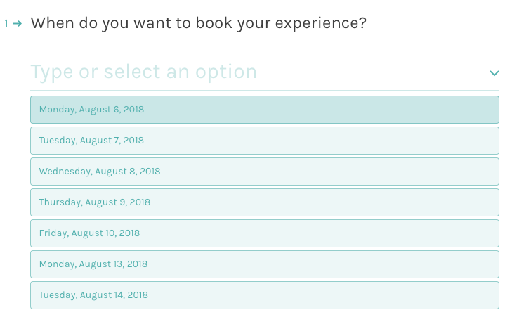
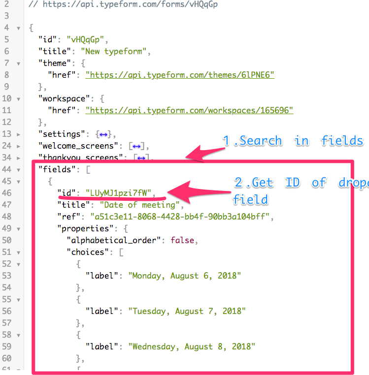

# typeform-field-update-lambda
Script to update value of a field on Typeform using AWS Lambda.

# What does it do?
You want to use Typeform so can people can book meetings with you, or reserve a day at your venue?
It's totally doable!
With this function we will update a dropdown field to always offer the possibility to select the 7 coming days.
You can customize how many days in the future you want to list, and if weekends should be listed too.
Every night, the script will update the values of the dropdown, so you don't have to do anything.

Here is how it looks like:

# How to use it?
Pre-requesites:
- a Typeform account, create one [here](https://)
- an AWS account, create one [here](https://aws.amazon.com)
- `aws-cli` installed and configured, [instructions](https://aws.amazon.com/cli/)
- [Serverless](https://serverless.com/framework/) framework installed locally - `npm install -g serverless`

## Get Typeform ready

1. Create a form if you don't have one.
2. Add a dropdown field if you don't have one already.
3. Get your typeform URL, and keep your form ID.
  `https://{ACCOUNT_NAME}.typeform.com/to/{FORM_ID}`
4. Hit `https://api.typeform.com/to/{FORM_ID}` directly in the browser.

5. Look at the JSON payload, under `fields` array and extract the `id` of the field you want to update.
6. Finally get yourself a Typeform personal token [here](https://admin.typeform.com/account#/section/tokens)

## Setup the function

1. Clone repo locally `git clone`
1. `cd `
1. run `npm install`
1. Open `serverless.yml`
1. Update environment variables with your own:
      `INTERVAL: 7` # How many days you want to list
      `TIMEZONE: 'America/Los_Angeles'` # Change it to the one of your choice, supports [IANA](https://moment.github.io/luxon/docs/manual/zones.html#iana-support)
      `FORM_ID: 'YOUR_FORM_ID'` # Which typeform you want to update
      `FIELD_ID: 'YOUR_FIELD_ID'` # Id of the field you want to update
      `TF_TOKEN: 'YOUR_TYPEFORM_TOKEN`' # Typeform API personal token
1. Test the function locally in your terminal with the following command `sls invoke local -f daySync`
You could see in the logs the values that will be pushed to your dropdown field. If they look ok, it's ready for production.

7. Deploy function to production `sls deploy`

The function is setup to be called every day at `00:01am`, you can change it in `serverless.yml` under `schedule` property.

# Contribute
Something is mispelled, the code could be optimized, you want to add features...?
Feel free to fork this repo and summit a pull request.

First timers welcome 😃

# Build your own
This is a showcase of what's doable to enrich your typeform fields with data. Using this function as an example you build more complex interactions.

[Let us know](https://developerplatform.typeform.com/to/Xc7NMh?utm_source=github&utm_medium=repo&utm_campaign=typeform-field-update-lambda) if you are building something.
